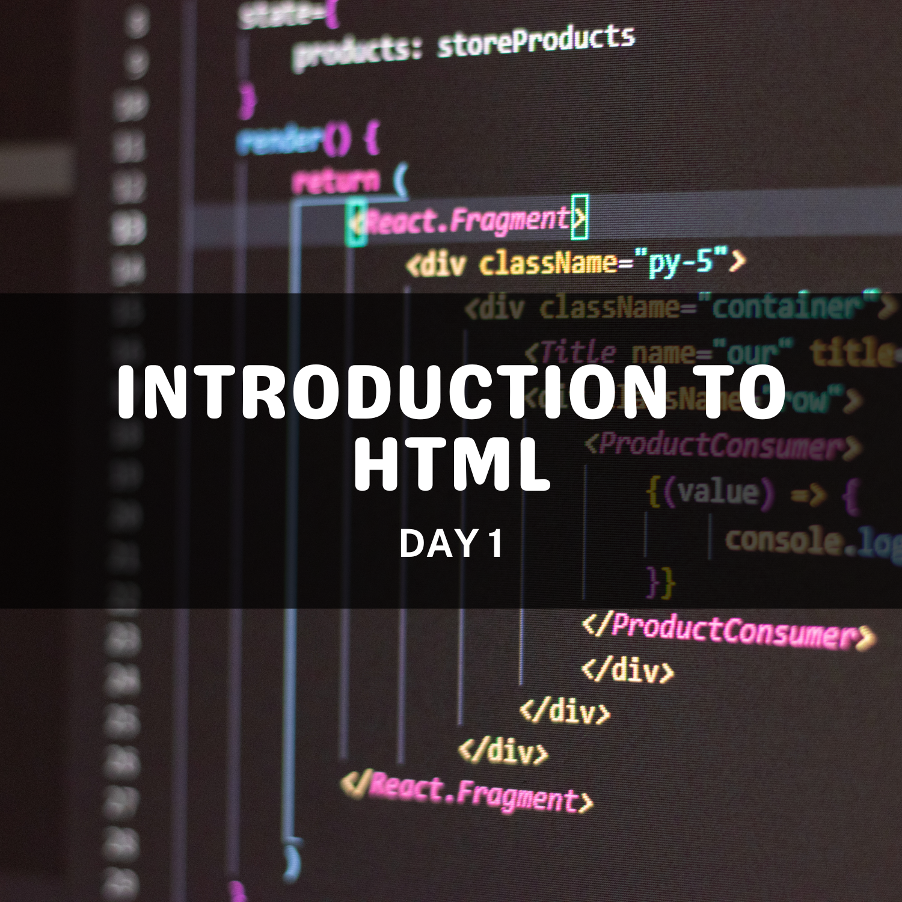

<h1 align="center">🚀 30 Days of Frontend 🚀</h1>

Welcome to **30 Days of Frontend**! 🚀 Join us on this thrilling month-long adventure into the world of web development. Whether you're a seasoned designer 🎨 with years of experience or an inquisitive newcomer 🤓 eager to dive in, get ready to unravel the wonders of frontend development 🔍. We'll delve into the essential concepts of HTML, CSS, JavaScript, and more.

But this isn't just about theory and technical terms – we'll apply our newfound knowledge by crafting engaging and practical projects 🛠️ that showcase the magic of frontend development. It's a hands-on learning journey designed to not only enhance your skills but also spark your creativity. So, are you prepared to embark on this captivating coding adventure with us?

---

### 👀 What's Inside It

This repository contains the following **main** folders:

1. **frontend-lessons folder**: consisting of all the files in every day of CodeQuest. (See **[📅 ┊ Table of Contents](#📅-┊-table-of-contents)** below)

2. **projects folder**: consisting of all the necessary projects the participants need to submit to complete CodeQuest. [Projects](projects)

---

### 📅 ┊ Table of Contents  

|
<h4 bottom='0'><a href='day-1'>Introduction to HTML</a></h4>
 |
<h4 bottom='0'><a href='day-2'>More HTML Elements</a></h4>
 |
<h4 bottom='0'><a href='day-3'>Semantics</a></h4>
 |
<h4 bottom='0'><a href='day-4'>Introduction to CSS</a></h4>
 |
<h4 bottom='0'><a href='day-5'>The Box Model, CSS Layout, etc.</a></h4>
 |
| - | - | - | - | - |
|
<h4 bottom='0'><a href='day-6'>More CSS Styling</a></h4>
 |
<h4 bottom='0'><a href='day-7'>CSS Flexbox</a></h4>
 |
<h4 bottom='0'><a href='day-8'>CSS Grid</a></h4>
 |
<h4 bottom='0'><a href='day-9'>Responsive Design</a></h4>
 |
<h4 bottom='0'><a href='day-10'>Project: Portfolio</a></h4>
 |
|
<h4 bottom='0'><a href='day-11'>Project: Portfolio</a></h4>
 |
<h4 bottom='0'><a href='day-12'>Introduction to JavaScript</a></h4>
 |
<h4 bottom='0'><a href='day-13'>JavaScript Fundamentals</a></h4>
 |
<h4 bottom='0'><a href='day-14'>Conditional Statements</a></h4>
 |
<h4 bottom='0'><a href='day-15'>Loops</a></h4>
 |
|
<h4 bottom='0'><a href='day-16'>Functions</a></h4>
 |
<h4 bottom='0'><a href='day-17'>Arrays</a></h4>
 |
<h4 bottom='0'><a href='day-18'>Objects</a></h4>
 |
<h4 bottom='0'><a href='day-19'>JSON (JavaScript Object Notation)</a></h4>
 |
<h4 bottom='0'><a href='day-20'>Interacting with the Document Object Model (DOM)</a></h4>
 |
|
<h4 bottom='0'><a href='day-21'>Selecting and Modifying Elements</a></h4>
 |
<h4 bottom='0'><a href='day-22'>Creating and Deleting DOM elements</a></h4>
 |
<h4 bottom='0'><a href='day-23'>Event Listeners</a></h4>
 |
<h4 bottom='0'><a href='day-24'>Project: Rock-Paper-Scissors</a></h4>
 |
<h4 bottom='0'><a href='day-25'>Project: Rock-Paper-Scissors</a></h4>
 |
|
<h4 bottom='0'><a href='day-26'>Project: Number Guessing Game</a></h4>
 |
<h4 bottom='0'><a href='day-27'>Project: Number Guessing Game</a></h4>
 |
<h4 bottom='0'><a href='day-28'>Project: Number Guessing Game</a></h4>
 |
<h4 bottom='0'><a href='day-29'>Project: Number Guessing Game</a></h4>
 |
<h4 bottom='0'><a href='day-30'>Project: Number Guessing Game</a></h4>
 |

---

### 💫 Getting Started

Use this template to create your own repository with existing directory structure and files to participate in our **CodeQuest: 30 Days of Frontend**.

1. On GitHub.com, navigate to the main page of this repository and click the **`Use this template`** button.

    

2. Name it with the same name as this repository (*AWSCC-CodeQuest-Frontend*), and make it **public**.
   > ***NOTE***: The repository name should be in the format of **AWSCC-CodeQuest-Frontend** (Do not copy exactly the same name as in the image below) 

   

3. On the lower right, click **`Create repository`**.

   

   and it should generate the repository in your account.

   > ***NOTE***: The repository name should be in the format of **AWSCC-CodeQuest-Frontend** (Do not copy exactly the same name as in the image below) 

   

4. After creating a repository, copy the repository URL and paste it in our **[CodeQuest Tracker Sheet](https://docs.google.com/spreadsheets/d/1OsXL63ei1HblY7-gXD8uMbSoWdZJlD02mTbrjvcSsNo/edit#gid=0)** in your corresponding row.

    > Note: If you are having trouble with the CodeQuest Tracker Sheet, do not hesitate to directly message any DSWD officers or email us at awscloudclub.pupmnl.dswd@gmail.com

5. Finally, clone the repository by clicking the **`Code`** button on the top right side of the repository's main page and clicking the **`Open with GitHub Desktop`** button to redirect to your GitHub Desktop application.

    

6. And just click the **`Clone`** button to clone it to your computer.

    

---

### ✉️ Submissions

**CodeQuest** is made to provide participants an immersive, hands-on coding experience by guiding them through the creation of small projects. Every day of CodeQuest contains a particular knowledge that is essential to build the foundations of your frontend development skills.

We encourage you to share your progress in [📈┊codequest-progress](https://discord.com/channels/1106592546815225878/1175409781540925521) to serve as motivation for others and to open up discussions and reviews to gain further insights about a particular topic.

> *example*:
>
> **Day**: 10-11 of Frontend
>
>**Topic**: HTML and CSS project
>
>**Highlights**: I learned how to use HTML and CSS to create a portfolio website.
>
>**Attachments**: (optional)

To finish our **CodeQuest: 30 Days of Frontend**, you need to submit **4** projects for your completion to be acknowledged:

    .
    ├── projects
    │   ├── 01-blog-post     # HTML project (day 3 & 9)
    │   ├── 02-your-own-portfolio     # CSS project (day 10-11)
    │   ├── 03-rock-paper-scissors       # HTML and CSS project (day 24-25)
    │   ├── 04-number-game       # final project (day 26-30)
    └── ...

> Note: There are exercises/challenges included in some days that you are not required to submit but is encouraged to try to test how much knowledge you've gained after finishing each day!

<h1 align='center'>Enjoy coding!~</h1>
