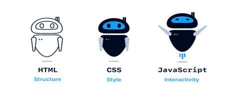
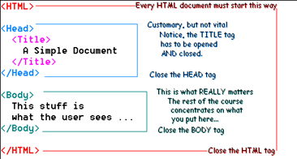
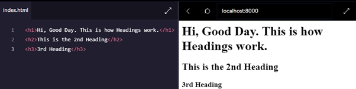
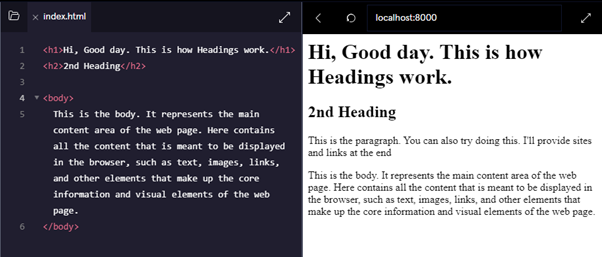
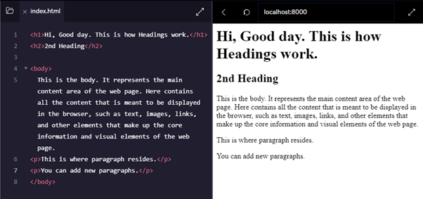
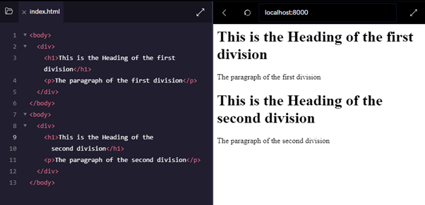
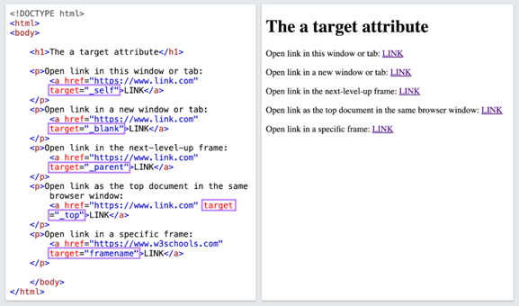

<div align="center">
   
</div>
<br>

**<h1 style="justify-content: center;"> DAY 1: INTRODUCTION TO HTML </h1>**

<h3 style="color: red;">What is HTML? </h3>

**HTML** stands for <mark style="background-color: red; color: white"> **Hypertext Markup Language**</mark>, but you can just call it _"HTML"_ because that's easier.

Imagine you want to make a beautiful drawing on a piece of paper. HTML is like a special set of instructions for the computer that tells it how to make a web page. Instead of using colors and pens like you do with paper, we use HTML to make web pages on the computer.

<div align="center">
   
</div>
Most structured text consists of headings and paragraphs, whether you are reading a story, a newspaper, a college textbook, a magazine, etc.

Structured content makes the reading experience easier and more enjoyable.

**_Here are some simple things you can do with HTML:_**

**<p style="color: #bd7122;">1. Headings</p>**
---
You can make titles at the top of your web page, like "My Cool Web Page" or "Hello, World!"

There are six heading elements: `h1`, `h2`, `h3`, `h4`, `h5`, and `h6`. Each element represents a different level of content in the document

```html
<h1> represents the main heading <b> biggest title </b>,
<h2> represents subheadings,
<h3> represents sub-subheadings, and so on.
<h1> opening tag
</h1> closing tag
```
<div align="center">

</div>

**<p style="color: #bd7122;">2. Body</p>** 
--- 
This `<body>` element in HTML is where the core content of a web page is placed. It is the user-visible part of the page and is responsible for presenting information and interactions to website visitors.

```html
<body> opening tag
</body> closing tag
```

<div align="center">

</div>

**<p style="color: #bd7122;">3. Paragraphs</p>** 
---
You can write sentences and stories using `<p>`. It's like writing a paragraph in a book.
The primary purpose of `<p>` is to separate blocks of text into distinct paragraphs. It automatically adds space before and after the enclosed text, creating a visual separation between paragraphs.

```html
<p> opening tag
</p> closing tag
```

<div align="center">

</div>

**<p style="color: #bd7122;">4. Division</p>**
---
The `<div>` element, short for "division," is a generic container used to group and structure content within a web page. It doesn't carry any inherent semantic meaning of its own, but it's a fundamental building block for creating layouts and organizing content. The primary purpose of the `<div>` element is to apply CSS styles or JavaScript functionality to groups of HTML elements.

```html
<div> opening tag
</div> closing tag
```

<div align="center">
   
</div>

**<p style="color: #bd7122;">5. Links</p>** 
---
You can make things clickable. If you want to link to your favourite game, you can use `<a>` and tell the computer where the game is on the Internet.
EXAMPLE:

```html
<a href="URL"> Text </a>
```

*Where:*

`href`- the most crucial attribute, which specifies the URL or location of the linked resource
`URL`- the destination of the link  
`Text`- the part that will be visible as a link

```html
<a> opening tag
</a> closing tag
```

<div align="center">
   
</div>

<br>

**<p style="color: #bd7122;">6. Images</p>**
---
You can show pictures of your favorite animals or superheroes using ``. You just need to tell the computer where the picture is.

```html

```

-  **src** -stands for "source" and is used with the `` element to specify the location (URL) of the image file that should be displayed on the web page.

-  **alt** -stands for "alternative text" and is used to provide a text description of the image.

So for example, if your image is called “front-end.jpg”, and it sits in the same directory as your HTML page, you could embed the image like this:

```html

```

If the image was in an images subdirectory, which was inside the same directory as the HTML page, then you'd embed it like this:

```html

```

And we can also embed the image using its absolute URL, for example:

```html

```

**<p style="color: #bd7122;">7. Lists</p>** 
---
You can create unordered, ordered, and description lists.

<b>UNORDERED LISTS</b>: An unordered list starts with the `ul` tag. Each list item starts with the `li` tag. The list items will be marked with bullets (small black circles) by default:

```html
<ul>
   <li> Coffee </li>
   <li> Tea </li>
   <li> Milk </li>
</ul>
```

<b>ORDERED LISTS</b>: An ordered list starts with the `ol` tag. Each list item starts with the `li` tag. The list items will be marked with numbers by default:

```html
<ol>
   <li> Coffee </li>
   <li> Tea </li>
   <li> Milk </li>
</ol>
```

<b>DESCRIPTION LISTS</b>: A description list is a list of terms, with a description of each term. The `dl` tag defines the description list, the `dt` tag defines the term (name), and the `dd` tag describes each term:

```html
<dl>
   <dt> Coffee </dt>
   <dd> - black hot drink </dd>
   <dt> Tea </dt>
   <dd> - black hot drink </dd>
</dl>
```

You can watch this to further explore HTML Lists!
[Learn HTML lists in 4 minutes 📋](https://youtu.be/-kXZvKxs9oA?si=lQE0H-oVO2JomKX-)

**<p style="color: #bd7122;">8. AND MORE!!</p>**
---
These are just a few basic HTML elements, but HTML offers many more tags and attributes to create and structure content on web pages.

Think of HTML as giving instructions to the computer to create your very own web page, just like how you make drawings on paper. It's like magic because you can make things appear on the computer screen for everyone to see!

As you learn more about HTML, you'll be able to create your own web pages and share fun things with your friends and family on the Internet. It's like being a *computer wizard!* 🧙‍♂️✨

You can try coding in sites like CodePen:
[CodePen](https://codepen.io/pen?template=XWovPyN)

Sites that can help you learn HTML:

[CodeCademy](https://rb.gy/ew0el)<br>
[W3schools](https://www.w3schools.com/html/)

You can watch this to learn more about the basics of HTML, from how to structure an HTML document to how to use some of the most common HTML elements. You will see how to create headers, paragraphs, bold and italic text, tables, sections, and forms.  

[HTML Tutorial for Beginners](https://youtu.be/FQdaUv95mR8?si=KDUe15qBrdmDZ63G)  
[Codecademy - HTML CheatSheet](https://www.codecademy.com/learn/learn-html/modules/learn-html-elements/cheatsheet)
