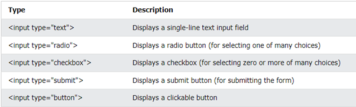

# **DAY 2: MORE HTML ELEMENTS**

## **HTML Formatting Elements:**
- `<b>` - Bold text: The `<b>` element is used to make text bold. However, it doesn't convey any specific meaning; it's just for visual styling. 

<div align="center">

</div>

- `<strong>` - Important text: Similar to `<b>`, the `<strong>` element is used to make text bold. But it also carries semantic meaning, indicating that the text is of strong importance or emphasis, which can be useful for accessibility and SEO.

<div align="center">

</div>

- `<i>` - Italic text: The `<i>` element is used to render text in italic style. Like `<b>`, it doesn't convey any particular meaning by itself and is primarily used for visual styling. 

<div align="center">

</div>

- `<em>` - Emphasized text: The `<em>` element is used to emphasize text. It carries semantic meaning, indicating that the text should be emphasized, often displayed in italics. It's beneficial for accessibility and SEO.

- `<mark>` - Marked text: The `<mark>` element is used to highlight or mark a specific portion of text. It's often displayed with a background color to draw attention to the marked content. 

- `<small>` - Smaller text: The `<small>` element is used to make text smaller in size. It's typically used for fine print, disclaimers, or copyright information. 

- `<del>` - Deleted text: The `<del>` element is used to represent text that has been deleted or removed from the document. It's often displayed with a strikethrough style. 

- `<ins>` - Inserted text: The `<ins>` element is used to represent text that has been added or inserted into the document. It's often displayed with an underline style. 

- `<sub>` - Subscript text: The `<sub>` element is used to render text as a subscript, which is typically smaller and placed below the baseline. It's often used for chemical formulas, mathematical notations, and footnotes. 

- `<sup>` - Superscript text: The `<sup>` element is used to render text as a superscript, which is smaller and placed above the baseline. It's often used for exponents, footnotes, and mathematical notations.

## **Useful HTML Character Entities:**

   <div align="center">
   
   </div>

### **HTML IMAGES**
---
Working with images in HTML involves embedding images in your web pages, setting their properties, and ensuring they are appropriately styled and accessible. Here's a step-by-step guide on how to work with images in HTML:

1. **Inserting an image** - Use the `` element to insert an image into your HTML document. The src attribute specifies the image file's source (URL), and the alt attribute provides alternative text for accessibility.

   ```html
   
   ```

2. **Image Source (URL)** - Make sure the image file is hosted on a web server or accessible via a relative or absolute URL. Relative URLs are used when the image is in the same directory or a subdirectory of your HTML file.

3. **Alternative Text** -  Provide meaningful and concise alternative text using the alt attribute. This text describes the image's content or purpose and is important for accessibility.

4. **Image Size and Dimensions** - Use the width and height attributes to specify the image's dimensions in pixels. This helps browsers allocate space while the image loads, preventing layout shifts. 

   ```html
   
   ```

5. **Linking Images** -
   Wrap images in `<a>` tags to make them clickable and link to other web pages or resources.


   ```html
   <a href="https://www.example.com">
   
   </a>
   ```

<br>

***Watch this to further explain how HTML images work:***  
[Learn HTML images in 3 minutes](https://youtu.be/Hh_se2Zqsdk?si=Cz64J5yp5k-k3HtX)

### **HTML FORMS**
---
An HTML form is an essential element of a web page that allows users to input data and submit it to a web server for processing. Forms provide a structured way to collect information from website visitors, such as text, numbers, selections, and more. It is a fundamental part of web development and is used for various purposes, including user registration, search boxes, contact forms, surveys, and e-commerce checkout processes.

#### **Key components of an HTML form include:**
---

1. **Form Element**: The `<form>` element is a container for different types of input elements, such as: text fields, checkboxes, radio buttons, submit buttons, etc.

2. **Input Element**: The HTML `<input>` element is the most used form element. An `<input>` element can be displayed in many ways, depending on the type attribute.

   <div align="center">
   
   </div>

   <br>

      ```html
      <input type="button">: Creates a clickable button, often used in JavaScript for custom interactions. 

      <input type="checkbox">: Provides a checkbox for selecting multiple options or indicating a binary choice. 

      <input type="email">: Collects an email address and provides basic email validation. 

      <input type="file">: Lets users upload files (e.g., images, documents) to a server. 

      <input type="password">: Collects and masks text as a password for security.

      <input type="radio">: Presents radio buttons for selecting a single option within a group of choices. 

      <input type="range">: Creates a slider for selecting a value within a specific range. 

      <input type="reset">: Resets form fields to their initial values when clicked.

      <input type="search">: Provides a text input for searching, typically with a search icon. 

      <input type="submit">: Represents a button that submits the form when clicked. 

      <input type="text">: Collects text data (single-line text input). 

      <input type="url">: Collects a URL (web address) and often includes validation for URLs. 
      ```

> To find out more about input types, click this:  
> 
> [MDN webdocs: Input Cheat Sheet](https://developer.mozilla.org/en-US/docs/Web/HTML/Element/input/button)  
[W3Schools HTML Forms](https://www.w3schools.com/html/html_forms.asp)

***You can watch this to further explain how HTML Forms work:***
[HTML Forms](https://youtu.be/2O8pkybH6po?si=er_w1FhHs_wvO3w7)

   > These different input types provide specialized functionality for various data collection needs in web forms. They can be used in combination with other form elements to create user-friendly and interactive web forms.

   <br>

3. **Text Area** - `<textarea>` is an element used to create a multi-line text input field on a web page. It allows users to enter and edit text that can span multiple lines.
A text area can hold an unlimited number of characters, and the text renders in a fixed-width font (usually Courier). 

   ```html
   <textarea> opening tag
   </textarea> closing tag
   ```

   <div align="center">
   
   
   </div>
   <br>

   `rows` and `cols` are attributes that determine the number of visible rows and columns for the text area. You can adjust these values to control the size of the text area.

   <br>

4. **Select Menus (Dropdowns)**-  In HTML, you can create select menus, also known as dropdown menus or select elements, to allow users to choose from a list of options. To create a select menu, you use the `<select>` element along with one or more `<option>` elements. 

   ```html
   <select>
      <option value="option1">Option 1</option>
      <option value="option2">Option 2</option>
      <option value="option3">Option 3</option>
   </select>
   ```

-  `<select>`: This is the opening tag for the select menu. It defines the start of the select element. 

-  `<option>`: These are the individual options within the select menu. You can have as many `<option>` elements as you need, each representing a different choice. 

- The `value` attribute is used to specify the value associated with each option. This value is sent to the server when the form is submitted, and it can be different from the text displayed to the user. 

>Text content between the `<option value=”option1”>` and `</option>`tags: This is the visible text that users see in the dropdown list.


***EXAMPLE:***  
      <div align="center">
      
      
      </div>

5. **Submit Button** - To add a submit button in a form, use the `<input>` element with type="submit" within a `<form>` element:

   ```html
   <form action="process_form.php" method="post">
   <input type="submit" value="Submit">
   </form>
   ```

- `<form>`: Opening tag for the form element where you place form elements.
action: Specifies the URL for form data submission.
method: Specifies data submission method (commonly "get" or "post").
- `<input type="submit">`: Creates the submit button.
value: Defines the button text, e.g., "Submit."

<br>

   > When the user clicks the "Submit" button, the form data will be sent to the URL specified in the action attribute, and the form data will be processed on the server according to the method (POST or GET) specified in the method attribute. You can also style the submit button using CSS to change its appearance, and you can use JavaScript to add interactivity to it, such as form validation or handling form submissions without a page reload.
