**<h1 align="center"> DAY 3: HTML STRUCTURES AND SEMANTICS </h1>**

**<h2>NON-SEMANTIC ELEMENTS</h2>**

1. `<div>` Element- The `<div>` element is a block-level container used to group and structure content together. It doesn't carry any specific semantic meaning and is often used for styling or scripting purposes. It creates a new block-level box within the document flow.

<div align="center">
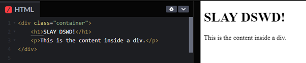
</div>

In this example, the `<div>` is used to group the title and paragraph, and it can be targeted for styling or scripting with the class attribute (which will be tackled on later!).

> **Grouping Content in `<div>` - You can use `<div>` to group related content, apply styles, or organise content for JavaScript interactions.**  
 
***Here's how you can use it to group content:***
<div align="center">
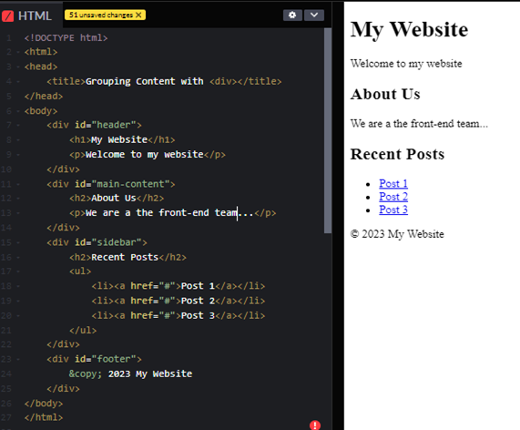
</div>

2. `<span>` Element- The `<span>` element is an inline-level container used to apply styles or scripts to small portions of text or inline elements. Like `<div>`, it doesn't carry specific semantic meaning but is often used for inline styling or scripting.

**<h3> Changing Text Color </h3>**
In this example, the `<span>` is used to apply a specific style (red colour) to the word "red." These elements are essential for organising and applying styles and scripts to your web content. They are particularly useful when you want to target specific sections of text or group elements together for common styling or scripting purposes. 

<div align="center">
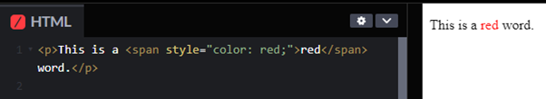
</div>

**<h3> Highlighting Text </h3>**
The `<span>` element is an HTML tag that is typically used to apply inline styles to a specific portion of text, allowing you to highlight or change the background color of that text. It is often used in conjunction with CSS to define the desired visual effects.

<div align="center">
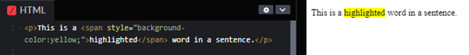
</div>

**<h3> Adding Font Style </h3>**
You can use `<span>` to apply different font styles to text.

<div align="center"> 
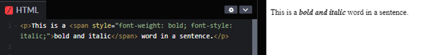
</div>

***You can refer to this link to further explore the `<div>` and `<span>` element:***  
[Learn HTML span & div in 2 minutes 🏁](https://youtu.be/yHX-UwAnoqk?si=QBHlDFPJqv8aJV-Q)

**<h3> Adding Underline or Strikethrough </h3>**
To apply underlines or strikethroughs to specific text, use the `<span>` element.

<div align="center">
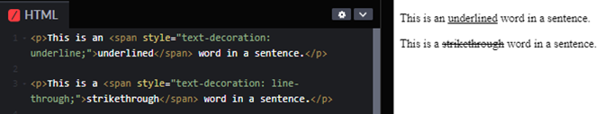
</div>

**<h3>Combining Styles</h3>**
You can combine multiple styles within a single `<span>` element.

<div align="center">
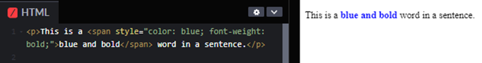
</div>

## **SEMANTIC ELEMENTS**
Semantic elements in HTML are tags that carry meaning about the structure and content of a web page, making it more accessible to both browsers and developers. Here are some of the most important semantic elements with code examples and detailed descriptions:

1. **`<header>`**: The `<header>` element represents the introductory content or a group of navigational links at the beginning of a document or section. It typically contains headings, logos, and navigation menus. This provides a clear indication of the main content's purpose and allows users to quickly navigate through the key sections of a page.

<div align="center">
    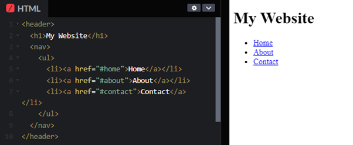
</div>

2. **`<nav>`**: The `<nav>` element is used to define a navigation menu on a web page. It often contains an unordered list `<ul>` of links `<a>` to different sections or pages of the website. This assists screen readers and search engines in identifying and understanding the navigation structure of the site, improving accessibility and SEO.

<div align="center">
    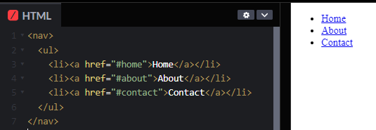
</div>

3. **`<main>`**:  The `<main>` element represents the main content of a document, excluding headers, footers, and sidebars. It's intended to encapsulate the unique, essential content of the page. This aids in accessibility by providing a clear delineation of the main content, helping screen readers and other devices focus on the essential information.

<div align="center">
    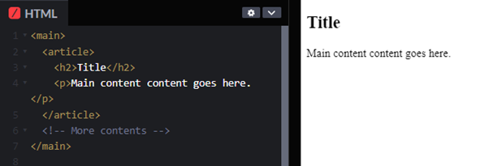
</div>

4. **`<article>`**: The `<article>` element encapsulates content that can stand alone and be distributed and reused independently. It could be a blog post, a news article, a forum post, or any piece of content with its context. This enhances document structure, making it more understandable for both developers and search engines. Improves content reuse and indexing.

<div align="center">
    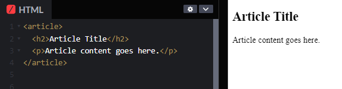
</div>

5. **`<section>`**: The `<section>` element groups related content together and typically includes a heading (`<h1>` to `<h6>`). It's used to organize content into distinct sections, enhancing the document structure. This provides a semantic way to organize content, making it easier to understand the hierarchy of information on a page and improving accessibility.

<div align="center">
    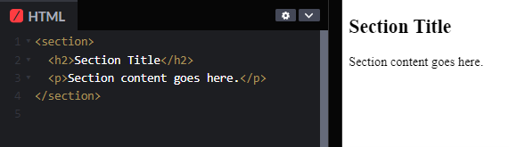
</div>

6. **`<aside>`**: The `<aside>` element represents content that is tangentially related to the content around it. It's often used for sidebars, pull quotes, or other content that complements the main content. This helps segregate secondary content from the main flow, improving readability and providing additional context without interfering with the primary narrative.

<div align="center">
    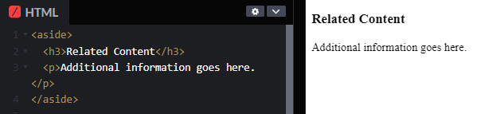
</div>

7. **`<footer>`**: The `<footer>` element represents the footer of a section or a page. It typically contains metadata, copyright information, links to related documents, and other supplementary information. This enhances the completeness of a document by providing information about its authorship, copyright, and related resources. Improves overall document structure.

<div align="center">
    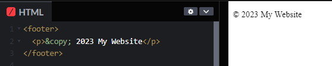
</div>

8. **`<figure>`** and **`<figcaption>`**: The `<figure>` element is used to encapsulate any content that is referenced from the main content, such as images, charts, or videos. The `<figcaption>` element provides a caption for the content inside `<figure>`. This enhances the semantic meaning of embedded content, making it clear that the content is related. Captions provide additional context, aiding users who may not interpret the visual content.

<div align="center">
    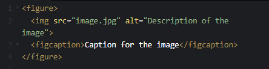
</div>

***You can try coding here:***
[CodePen - Semantics](https://codepen.io/pen)

***Try to copy and change this to your preferences:***

```html
<head>
    <title>span tag</title>
</head>
 
<body>
    <h2>Welcome our Dear Front-end Developer!</h2>

    <p><span style="background-color:lightgreen"> 
        Front-end developers</span> often work closely with back-end developers, designers, and product managers<span style="color:blue;"> 
       to create</span> a cohesive 
       <span style="background-color:lightblue;">user experience.
       </span> Slay, right?!!
    </p>
</body>
```

**<h2>This is the Output of the code I shared:</h2>**

<div align="center">
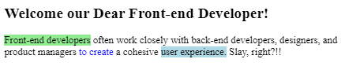
</div>


***You can follow these content creators on youtube, and watch their videos about HTML:***

> -  [Kevin Stratert: HTML Tutorial for Beginners](https://youtu.be/FQdaUv95mR8?si=ZhyFNW87R_ZzP-3n)  
> - [BroCode: Learn HTML in 1 hour 🌎](https://youtu.be/HD13eq_Pmp8?si=cSWpCEPALMu_vv55)  
> - [SDPT Solutions: HTML Tutorial #1: Overview & Structure | Web Development | Filipino | Tagalog](https://youtu.be/29l2qxSJSIw?si=Z6AY2Uhp7V4I4O7M)  
> - [SuperSimpleDev: HTML & CSS Full Course - Beginner to Pro](https://youtu.be/G3e-cpL7ofc?si=3C14K3KFfRLzo-yU)

***Go to these websites that tackles HTML:***  
> - [freeCodeCamp: What is HTML?](https://www.freecodecamp.org/news/what-is-html-definition-and-meaning/)  
> - [html.com: HTML for Beginners](https://html.com/)  
> - [Programiz: Learn HTML](https://www.programiz.com/html)

***You can save these Cheat Sheets:***   
> - [Stronybook: The Complete HTML Cheat Sheet](https://www3.cs.stonybrook.edu/~pramod.ganapathi/doc/CSE102/CSE102-CheatSheetHTML.pdf)  
> - [Stanford HTML Cheatsheet](https://web.stanford.edu/group/csp/cs21/htmlcheatsheet.pdf)  
> - [HTML CHEAT SHEET](https://html.com/wp-content/uploads/html-cheat-sheet.pdf)

**<h2 align=center>CONGRATULATIONS! 🥳🎉 YOU HAVE COMPLETED THE HTML PART OF THE CODEQUEST - 30 DAYS OF FRONTEND!</h2>**

Before we proceed to the next part of CodeQuest which will be how to use CSS in order to style stuff, We'll be doing an exercise in order to test your newly learnt skills in HTML. Follow the guide below to create a blog post using HTML:

[First Project - Blog Post (HTML Structure)](../../projects/01-blog-post/HTML-README.md)

**<h3>QUOTE OF THE DAY:</h3>**

> *“Remember that you can always learn things, not only in school. Try to self-learn and dive into the world of technology, embracing the beauty of HTML and other programming languages that you can explore during this 30-day coding journey.”*


