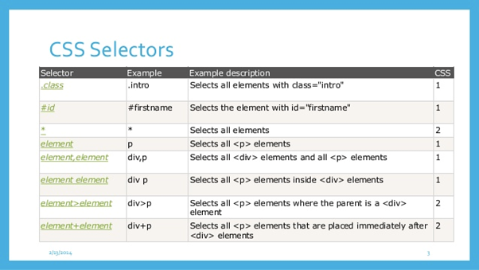

**<h1 align="center"> DAY 4: INTRO TO CSS </h1>**

## _What is <strong>CSS</strong>?_

According to W3School, CSS is the language we use to style an HTML document. It describes how HTML elements should be displayed. So, CSS is like a set of instructions that lets you choose colors, fonts, sizes, spacing, and positions for everything on a website, making it look just the way you want it to. It's like decorating a room but for the internet!

**<h3 align="center">CSS SYNTAX</h3>**  

Here's an overview of the basic syntax of CSS:

<div align="center">
  
</div>

-  **Selectors**: Selectors are used to target HTML elements that you want to style. You can select elements based on their tag name, class, ID, attributes, or their position in the document structure.

-  **Declaration Block**: After selecting an element, you define a declaration block enclosed in curly braces `{}`. Inside the declaration block, you specify the property and value pairs you want to apply to the selected elements.


### **Inline, Internal, and External CSS**

There are three ways to insert those sets of instructions: `inline`, `internal`, and `external`.

**<h2 align="center">​​Inline CSS</h2>**
Inline CSS is a way to apply styles directly to individual HTML elements on a web page. It's like giving specific instructions for just one element. You use the style attribute within the HTML tag to add your styles.

#### **For example:**

```html
<p style="color: red; font-size: 30px;">
	This text is red and 30 pixels in size according to the Inline CSS syntax
	above.
</p>
<p>This text does not have any styling :(</p>
```

**Try it yourself**: [Code Pen - Inline CSS](https://codepen.io/pen?template=XWovPyN)

This is handy when you need a quick change for a single element, but it's not recommended for styling a whole webpage because it mixes HTML and CSS in a way that can become messy.

**<h2 align="center">Internal CSS</h2>**

Internal CSS is when you put your styles in the `<style>` section within the HTML document. This allows you to define styles for multiple elements on the same page, keeping all the styles together.

***Here's an example:***

```html
<head>
	<style>
		h1 {
			color: blue;
		}
		p {
			font-size: 18px;
			color: red;
		}
	</style>
</head>
<body>
	<h1>Hello, World! I'm an example of Internal CSS.</h1>
	<p>I am also an example of Internal CSS!</p>
</body>
```

**Try it yourself:**
[Code Pen - Internal CSS](https://codepen.io/pen?template=QWzeVVe)

This is a step up from inline CSS and is useful for single pages where you want to control the styling without affecting other pages on your website.

**<h2 align="center">External CSS</h2>**

External CSS is where you create a separate CSS file and link it to your HTML document using the `<link>` element.
<br>

***Here's how it works:***

**index.html**

```html
<head>
	<link rel="stylesheet" type="text/css" href="styles.css" />
</head>
<body>
	<p>This text is styled from an external CSS file.</p>
</body>
```

**styles.css**

```css
p {
	color: green;
	font-size: 14px;
}
```

**Try it yourself:**
[Code Pen - External CSS](https://codepen.io/pen?template=rNoXZKe)

This is incredibly useful when you have multiple pages and want to maintain a consistent look and feel across your entire website. Here's how it works:

This way, you can keep your HTML and CSS separate, making your code cleaner and easier to manage as your website grows. External CSS is the preferred method for most websites because it keeps your styles organized

**<h2 align=center>CSS Selectors and Properties.</h2>**

CSS selectors streamline the process of styling HTML elements by enabling you to target multiple elements simultaneously. This eliminates the need to duplicate styles for each individual element, making your styling more efficient and less repetitive.

When you're new to CSS, learning about selectors is one of the first things you'll do.  

***Here are some of the most used CSS selectors:***

<div align="center">

</div>

But don't stress; you don't have to memorize them all right away. You'll learn them gradually as you go. ***Here’s a cheat sheet for all the selectors:*** [CSS Selectors Cheat Sheet](https://www.w3schools.com/cssref/css_selectors.php)

CSS properties are your design tools for web pages. They are like commands to style elements the way you want. Here are some common ones:

-  **`color`**: This is like picking the color of your text. You can choose any color you like, such as `color: blue;` and the text will turn blue
-  **`font-size`**: This is for determining text size, e.g., `font-size: 18px`;
-  **`background-color`**: Paint element backgrounds, e.g., `background-color: yellow`;
-  **`margin and padding`**: These are like adding space around or inside an element. It's how you create gaps or distances. For example, `margin: 10px;` adds a 10-pixel gap around an element
-  **`border`**: Draw lines around elements, specify thickness, style, and color, e.g., `border: 2px solid black;`
-  **`text-align`**: Align text left, right, or center, e.g., `text-align: center;`
-  **`font-family`**: Choose text style and fonts, e.g., `font-family: Arial, sans-serif;`
-  **`font-weight`**: Make text bold, italicized, e.g., `font-weight: bold;`

*You can find a handy cheat sheet for both selectors and properties at:*  
[W3Schools Cheat Sheet](https://www.w3schools.com/cssref/index.php)

**<h2 align=center>Selecting Elements with IDs and Classes</h2>**

In CSS, you can **target specific elements using their IDs and Classes.** An **ID** is like a **unique name** for an element, and it can only be used once on a page. Think of it as a special address for that element. A **class** is like a **label that you can use on multiple elements.** It's like tagging them.

*In this code example given, we have an HTML document and CSS code.*  
**Try it yourself**:
[Code Pen - Selecting Elements with IDs and Classes](https://codepen.io/pen?template=YzdmJdo)

***<h4>Let's break it down:</h3>***

**IDs**:
- In the HTML, we have a big heading enclosed in `<h1>`. We've given it a unique ID, which is like a special name. In this case, we named it "title" by using id="title".
- Then, in the CSS file, we use `#title` to say, "For the element with the ID 'title,' do something special." Here, we make the text blue and larger.

**Classes**:
- In the HTML, we have two paragraphs. The second one has a class, which is like a group name. We named it "highlight" by using `class="highlight"`.
- In the CSS, we use **.highlight** to say, "For all elements with the class 'highlight,' do something special." Here, we give them a yellow background and bold text.

So, the `<h1>` element with the "title" ID gets special treatment, making its text blue and bigger. The paragraph with the "highlight" class gets the group treatment, which gives it a yellow background and bold text. The other paragraph doesn't have an ID or class, so it stays the way it is.

When you open this code in CodePen, you'll see how the CSS styles are applied to the specific elements with IDs and classes, making them stand out or look different from the other elements. This is how you can use IDs and classes to select and style elements on a web page.

Explore these other resources to start your journey into the world of CSS and enhance your web development skills. Happy coding!

## Online Courses
1. [**MDN Web Docs - CSS Basics**](https://developer.mozilla.org/en-US/docs/Learn/Getting_started_with_the_web/CSS_basics): MDN Web Docs is a highly reputable resource for web development, and their CSS Basics tutorial is a great starting point.

2. [**Codecademy - CSS Course**](https://www.codecademy.com/learn/learn-css): Codecademy offers interactive coding exercises and projects to help you learn CSS in a hands-on way.

3. [**freeCodeCamp - CSS and Visual Design**](https://www.freecodecamp.org/learn/responsive-web-design/#css-and-visual-design): freeCodeCamp provides a comprehensive curriculum on web development, including a section on CSS and visual design.

4. [**Codrops CSS Reference**](https://tympanus.net/codrops/css_reference/): Codrops offers a detailed CSS reference with tutorials and examples.
