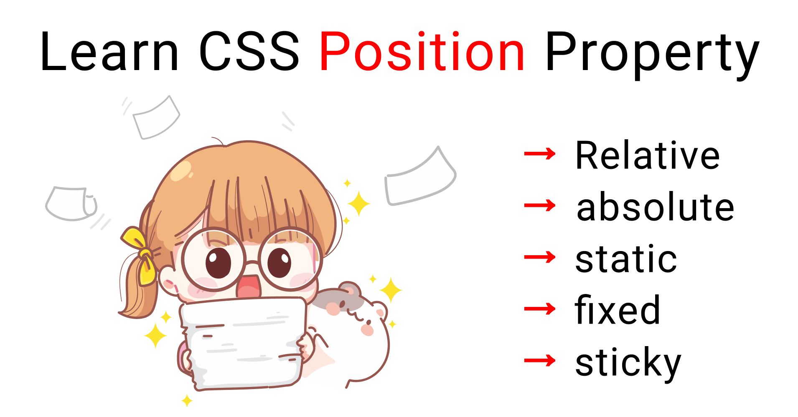

**<h1 align=center>DAY 5: THE BOX MODEL, CSS LAYOUT, ETC. </h1>**

Imagine your web page elements, like pictures and text, are inside a magic box. This box has four important parts:

-  **Content**: This is where your stuff (text, images) lives, like a toy in a toy box.
-  **Padding**: It's like a cushion around the content. When you put more pillows around your toy, it gets some space between it and the box.
-  **Border**: This is like a fancy frame around the box. You can pick the color and thickness of this frame, just like picking a frame for a picture.
-  **Margin**: It's like an invisible force field around the box, keeping it away from other things. You can choose how much space is outside the box, like telling your toys to stay away from other toys.

<br>


<br>

> So, when you want to make your web page look nice, you can change the size of the content, add cushions (padding), put a fancy frame (border), and tell it to stay away from other things (margin). That's how the CSS Box Model helps you make your web page pretty and organized!
> 
This code demonstrates the CSS Box Model by styling a simple box. You can uncomment the sections in CodePen under "Experiment and modify the following properties" to play around and see how different CSS properties affect the box model. You can uncomment one section at a time and refresh the HTML page to see the changes. This hands-on approach will help you understand how the box model works.


**HTML (index.html):**
```html
<!DOCTYPE html>
<html>
<head>
    <link rel="stylesheet" type="text/css" href="styles.css">
</head>
<body>
    <div class="box">
        This is a box with CSS Box Model.
    </div>
</body>
</html>
```

**CSS (styles.css):**

```css
/* CSS Box Model Example */
/* Let's style a simple box element */

/* 1. Define the box with some basic styles */
.box {
    width: 200px;           /* Width of the content area */
    height: 100px;          /* Height of the content area */
    background-color: #3498db;
    color: #ffffff;
    padding: 20px;          /* Padding inside the content area */
    border: 2px solid #2980b9; /* Border around the content area */
    margin: 20px;           /* Margin outside the border */
}
```
**The CSS Box Model:**
   - **The content area**: Width and height of the element's content.
   - **Padding**: Space between the content and the border.
   - **Border**: A visible border around the padding.
   - **Margin**: Space between the border and surrounding elements.

```css
/* Experiment and modify the following properties to see how they affect the box model */

/* Try changing the width, height, and background color */
box {
    width: 250px;
    height: 150px;
    background-color: #e74c3c;
}

/* Try adjusting the padding */
box {
    padding: 30px;
} 

/* Change the border style, width, and color */
box {
    border: 4px dashed #c0392b;
} 

/* Modify the margin to create space around the box */
box {
    margin: 30px;
} 

/* Add more content inside the box */
.box {
    padding: 20px;
}
.box p {
    margin: 0;
} 

/* Center the box in the middle of the page */
.box {
    margin: 0 auto;
} 
```

***Try this out in a CodePen!***  
[CodePen - CSS Box Model ✍](https://codepen.io/pen?template=XWOMdXm)


**<h2>CSS Layout </h2>**

CSS layout is like a blueprint for arranging things on a web page. Imagine you're building a house, and you need to decide where the rooms, windows, and doors go. CSS layout is about deciding where the different parts of a web page, like text, images, and buttons, should be placed.

Here are some key ideas about CSS layout:

-  **Boxes**: In web design, everything is in boxes. Each element, like a heading or a picture, is inside a box. CSS layout helps decide how big these boxes are and where they go on the page.

-  **Position**: You can tell the boxes where to go. Do you want the picture at the top or the bottom? CSS layout helps you with that.

-  **Spacing**: You can also control how much space is between the boxes. This is like deciding how far apart the rooms in your house should be.

-  **Flow**: Sometimes, boxes flow next to each other, like words in a book. CSS layout helps you choose how things flow on the page.

-  **Responsive**: CSS layout is like a puzzle. It helps you make your web page look good on big screens and small phones. It's flexible, just like arranging furniture that can fit in different rooms.

**<h2>Positioning elements (static, relative, absolute).</h2>**

Positioning elements in CSS involves using different properties to control where elements appear on a web page. There are several positioning options: static, relative, and absolute.

### **Static Positioning:**

By default, **ALL** elements have a static position.
Elements with a static position are placed in the normal flow of the document.
You don't usually need to set position: static because it's the default behavior.

```css
element {
	position: static;
}
```

### **Relative Positioning:**

When you set an element's position to relative, you can use properties like top, right, bottom, and left to move the element from its normal position.
The element will still take up space in the normal flow, but you can shift it relative to that normal position.

```css
element {
	position: relative;
	top: 20px;
	left: 10px;
}
```

### **Absolute Positioning:**

Elements with an absolute position are removed from the normal flow, and they're positioned relative to the nearest positioned ancestor.
You can use properties like top, right, bottom, and left to precisely place the element.

```css
element {
	position: absolute;
	top: 50px;
	left: 30px;
}
```

> It's important to note that when you use absolute positioning, the element's position is determined by its closest ancestor with a relative, absolute, or fixed position. If there's no such ancestor, it's positioned relative to the initial containing block (usually the viewport).

### **Sticky Positioning:**

When you set an element's position to sticky, it starts off behaving like relative. It remains in the normal flow of the document until you scroll to a certain point.
Once you scroll past a specified offset (e.g., top: 50px), the element becomes "sticky" and sticks to that position on the screen.

As you scroll further, it will "unstick" and continue scrolling in the normal flow.

```css
element {
position: sticky;
top: 50px; /_ Specify the offset where it becomes sticky _/
}
```

> **Sticky positioning** is often used for navigation bars that stay at the top of the page when you scroll down, providing easy access to important links. It's a great way to create a user-friendly and visually appealing experience on web pages.

**If you want to learn more about CSS layout and the `position` property, check out  
[W3Schools' CSS Layout - The `position` Property](https://www.w3schools.com/css/css_positioning.asp).**


**For visual learning, check out this video animation of positioning created by Ali Reza from X (Twitter):**

<div align="center">
	<a href="https://twitter.com/Ali_Developer05/status/1713845222759977004?t=jorWTQSwr7r0QVSzv0xGCw&s=09">
	
	</a>
</div>