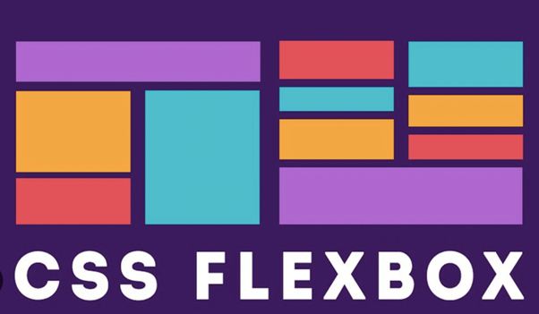
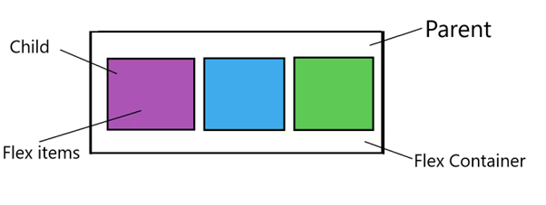

**<h1 align=center>DAY 7: Introduction to Flexbox</h1>**

<div align="center">
	
</div>

**Flexbox**, or _Flexible Box_, is a modern CSS layout model that makes it easier to create flexible and responsive web designs. It simplifies the way you arrange and align elements within a container. Key concepts include:

In Flexbox, the relationship between parent and child elements is crucial for creating flexible and responsive layouts. Flexbox, or the Flexible Box Layout, is designed to make it easier to distribute space and align items within a container, which can be considered the parent element in this context.

<div align="center">
	
</div>

*Here's a breakdown of the parent-child relationship in Flexbox:*

1. **Flex Container (Parent)**: This is the element that you designate as a Flexbox container using the `display: flex;` or `display: inline-flex;` CSS property. The container serves as the parent element that holds and controls the arrangement of its child items.

   ```css
   .flex-container {
     display: flex; /* or display: inline-flex; */
   }
   ```

2. **Flex Items (Children)**: These are the elements contained within the Flexbox container. They are the child items that will be arranged and aligned based on the rules you define for the container.

   ```html
   <div class="flex-container">
     <div class="flex-item">Child 1</div>
     <div class="flex-item">Child 2</div>
     <!-- ...and so on -->
   </div>
   ```

***The key aspects of the parent-child relationship in Flexbox are as follows:***

- **Direction of Flow**: The container defines the main axis along which its child items will be arranged. You can set this direction with the `flex-direction` property, which can be `row` (horizontal), `row-reverse`, `column` (vertical), or `column-reverse`.

**Give this [CodePen example](https://codepen.io/pen?template=vYbxxON) a try to see how it works.**
Here in this example, you will use the `flex-direction` property in CSS to control the direction of flow for child items in a Flexbox container. 

In this example, we have a Flexbox container with four child items. We'll change the `flex-direction` to see how it affects the layout of the child items:

**HTML:**
```html
<div class="flex-container">
  <div class="flex-item">1</div>
  <div class="flex-item">2</div>
  <div class="flex-item">3</div>
  <div class="flex-item">4</div>
</div>
```

**CSS:**
```css
.flex-container {
  display: flex;
  border: 2px solid #3498db;
  margin: 20px;
  padding: 10px;
}
```

***Try different flex-direction values***

**Default:** Items are arranged from left to right (horizontal)
```css
.flex-container {
  flex-direction: row;
}
```

Items are arranged from **right to left (horizontal)**

```css
.flex-container {
  flex-direction: row-reverse;
}
```

Items are stacked **vertically** from **top to bottom**
```css
.flex-container {
  flex-direction: column;
}
```
Items are stacked **vertically** from **bottom to top**
```css
.flex-container {
  flex-direction: column-reverse;
}

.flex-item {
  background-color: #e74c3c;
  color: #fff;
  text-align: center;
  width: 100px;
  height: 100px;
  margin: 10px;
}
```

You can test each `flex-direction` value by changing it in the `.flex-container` CSS rule to see how it affects the arrangement of the child items. Each value changes the direction of the main axis, which in turn affects the layout of the items.

- **Alignment**: The container can control the alignment of its child items along both the main axis and cross axis using properties like `justify-content`, `align-items`, and `align-content`. These properties determine how items are distributed and aligned within the container.

**Practice your Flexbox alignment skills with this interactive CodePen example: [Flexbox Alignment Practice](https://codepen.io/pen?template=MWLppjq)**.

This will help you understand how these properties affect the alignment and distribution of child items within a Flexbox container.

**HTML (index.html):**

```html
<!DOCTYPE html>
<html>
<head>
    <link rel="stylesheet" type="text/css" href="styles.css">
</head>
<body>
    <div class="flex-container">
        <div class="flex-item">1</div>
        <div class="flex-item">2</div>
        <div class="flex-item">3</div>
    </div>
</body>
</html>
```

**CSS (styles.css):**

**Flexbox Alignment Example**

**1.** Create a Flexbox container
```css
.flex-container {
    display: flex;
    border: 2px solid #3498db;
    margin: 20px;
    padding: 10px;
    height: 300px;
    width: 300px;
}
```
**2.** Change the 'flex-direction' to 'column' to align items vertically
    flex-direction: column;

**3.** Align items along the main axis (horizontally)
justify-content: flex-start (default), flex-end, center, space-between, space-around
```css
.flex-container {
    justify-content: center;
}
```

**4.** Align items along the cross axis (vertically)
align-items: stretch (default), flex-start, flex-end, center, baseline
```css
.flex-container {
    align-items: center;
}
```

**5.** Align multiple lines of items when 'flex-wrap' is enabled
align-content: stretch (default), flex-start, flex-end, center, space-between, space-around

```css
.flex-container {
    flex-wrap: wrap;
    align-content: space-around;
}
```

```css
.flex-item {
    background-color: #e74c3c;
    color: #fff;
    text-align: center;
    width: 100px;
    height: 100px;
    margin: 10px;
}
```

This code demonstrates the use of **`justify-content`, `align-items`,** and **`align-content`** properties in Flexbox. You can uncomment and modify the properties under each numbered comment to experiment with different alignment options and see how they affect the layout of the child items within the Flexbox container. 

- **Flexibility**: You can control how child items grow or shrink within the available space using properties like **`flex-grow`, `flex-shrink`,** and **`flex-basis`**. These properties help determine how child items respond to changes in the container's size.

**Practice Flexbox flexibility properties** (**`flex-grow`, `flex-shrink`,** and **`flex-basis`**) with this CodePen example: [Flexbox Flexibility Practice](https://codepen.io/pen?template=oNmZWGG). 
This sample will help you grasp how these properties influence the growth and shrinking of child items within a Flexbox container.**

**HTML (index.html):**
```html
<!DOCTYPE html>
<html>
<head>
    <link rel="stylesheet" type="text/css" href="styles.css">
</head>
<body>
    <div class="flex-container">
        <div class="flex-item">1</div>
        <div class="flex-item">2</div>
        <div class="flex-item">3</div>
    </div>
</body>
</html>
```

**CSS (styles.css):**  

**Flexbox Flexibility Example**

1. **Create a Flexbox container**
```css

.flex-container {
    display: flex;
    border: 2px solid #3498db;
    margin: 20px;
    padding: 10px;
    height: 200px;
    /* 2. Uncomment 'flex-direction' to see the effect on flex items */
    /* flex-direction: column; */
}

.flex-item {
    background-color: #e74c3c;
    color: #fff;
    text-align: center;
    width: 100px;
    height: 100px;
    margin: 10px;
    
    /* 3. Control how items grow and shrink */
    /* flex: flex-grow flex-shrink flex-basis; */
    /* Example: flex: 1 1 100px; */
}
```

This code demonstrates the use of `flex-grow`, `flex-shrink`, and `flex-basis` properties in Flexbox. You can uncomment and modify the `flex` property under comment 3 to experiment with different values and see how they affect the growth and shrinking behavior of the child items within the Flexbox container. 

- **Individual Control**: You can also override certain container-level alignment properties for individual child items using `align-self`. This allows you to fine-tune the alignment of specific items.


**Explore this CodePen example: [Flexbox Individual Control](https://codepen.io/pen?template=mdvWmpj) with detailed comments. Learn how to utilize the `align-self` property in Flexbox, which enables precise alignment control for specific child items. This hands-on practice will help you master the art of fine-tuning the alignment of individual elements within a Flexbox container.**

**HTML (index.html):**
```html
<!DOCTYPE html>
<html>
<head>
    <link rel="stylesheet" type="text/css" href="styles.css">
</head>
<body>
    <div class="flex-container">
        <div class="flex-item">1</div>
        <div class="flex-item">2</div>
        <div class="flex-item">3</div>
    </div>
</body>
</html>
```

**CSS (styles.css):**

*Flexbox Individual Control Example*

1. **Create a Flexbox container**
```css


.flex-container {
    display: flex;
    border: 2px solid #3498db;
    margin: 20px;
    padding: 10px;
    height: 200px;
}

.flex-item {
    background-color: #e74c3c;
    color: #fff;
    text-align: center;
    width: 100px;
    height: 100px;
    margin: 10px;
    
    /* 2. Override the 'align-items' property for specific items */
    /* align-self: auto (default), flex-start, flex-end, center, baseline */
    /* Uncomment and change for specific items to see the effect */
    /* Example: align-self: flex-start; */
}
```

This code demonstrates the use of the `align-self` property in Flexbox. You can uncomment and modify the `align-self` property under **comment 2** for specific child items to experiment with different values and see how it affects the alignment of those items within the Flexbox container. 

> In summary, **Flexbox** offers a powerful and intuitive way to manage the layout and alignment of child elements within a parent container, making it an essential tool for responsive web design and creating complex layouts. Understanding this parent-child relationship and the various Flexbox properties will enable you to create versatile and responsive designs.


**<h2 align=center> Key features and concepts of Flexbox include: </h2>**

-  **Flex Containers and Flex Items**: In Flexbox, you have a container, often referred to as a "flex container," that holds a collection of items, known as "flex items." The container is styled using the display: flex property, and the items inside are automatically adjusted to fit the available space.

-  **Main and Cross Axes**: Flexbox introduces the concept of two axes – the main axis and the cross axis. The main axis is defined by the flex-direction property and is the primary direction in which items are arranged. The cross axis is perpendicular to the main axis.

-  **Justify Content and Align Items**: Flexbox provides properties like justify-content and align-items to control how flex items are positioned along the main and cross axes. This allows you to easily center, space, or distribute items within the container.

-  **Flexibility**: Flexbox is particularly well-suited for creating flexible and responsive layouts. You can use the flex property to specify how much space an item should take up in relation to the other items. This enables you to create fluid and adaptive designs.

-  **Nested Flex Containers**: You can nest flex containers within one another, allowing for complex layouts with multiple levels of flexibility.

<br>

> Flexbox has become an essential tool for web designers and developers, as it simplifies the process of creating both basic and intricate layouts. It's well-supported in modern web browsers, making it a reliable choice for achieving responsive designs. Whether you're building a simple website or a complex web application, understanding Flexbox can greatly improve your ability to control the layout and positioning of elements within your web pages.

**A very detailed and beginner-friendly tutorial on CSS Flexbox can be found here:** [freeCodeCamp: CSS Flexbox Tutorial with Cheatsheet](https://www.freecodecamp.org/news/css-flexbox-tutorial-with-cheatsheet/).