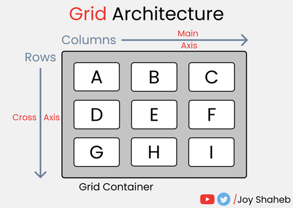

**<h1 align=center>DAY 8: CSS Grid</h1>**

**<h3>What is CSS Grid?</h2>**

<div align="center">
	
</div>

**CSS Grid** is a powerful layout system in CSS that allows you to create two-dimensional grid-based layouts in a highly flexible and precise way. It's designed to simplify the task of creating complex layouts for web pages, making it easier to align and distribute content in both rows and columns.CSS Grid is a powerful layout system in CSS that allows you to create two-dimensional grid-based layouts in a highly flexible and precise way. It's designed to simplify the task of creating complex layouts for web pages, making it easier to align and distribute content in both rows and columns.

## **Grid Parent and Grid Children in CSS Grid**

Just like in Flexbox, CSS Grid utilizes the concepts of grid parent and grid children. The grid parent is the container that holds the grid, and the grid children are the elements placed inside the grid.

[CodePen - Grid Example](https://codepen.io/pen?template=wvNdvxM)

### **HTML Structure (index.html)**
```html
<!DOCTYPE html>
<html lang="en">
<head>
  <meta charset="UTF-8">
  <meta name="viewport" content="width=device-width, initial-scale=1.0">
  <link rel="stylesheet" href="styles.css">
  <title>Grid Example</title>
</head>
<body>
  <div class="grid-container">
    <div class="grid-item">1</div>
    <div class="grid-item">2</div>
    <div class="grid-item">3</div>
    <div class="grid-item">4</div>
  </div>
</body>
</html>
```

### **CSS Styling (styles.css)**
```css
body {
  font-family: 'Arial', sans-serif;
  margin: 0;
  display: flex;
  justify-content: center;
  align-items: center;
  height: 100vh;
}

/* Create a grid container */
.grid-container {
  border: 2px solid gray;
  display: grid;
  grid-template-columns: repeat(2, 1fr); /* Two columns of equal width */
  grid-gap: 10px; /* 10px gap between grid items */
}

/* Style for grid items */
.grid-item {
  background-color: #3498db;
  color: #fff;
  padding: 20px;
  text-align: center;
}
```

### **Explanation:**

#### **CSS for Grid Parent:**
```css
.grid-container {
  display: grid;
  grid-template-columns: repeat(2, 1fr);
  grid-gap: 10px;
}
```

- **`display: grid;`**: Makes the `.grid-container` a grid parent, establishing a grid context.
- **`grid-template-columns: repeat(2, 1fr);`**: Defines two columns of equal width using the `1fr` unit.
- **`grid-gap: 10px;`**: Sets a 10px gap between grid items inside the grid parent.

#### **CSS for Grid Children:**
```css
.grid-item {
  background-color: #3498db;
  color: #fff;
  padding: 20px;
  text-align: center;
}
```

- Styles applied to each `.grid-item` (grid child).
- Gives grid children a blue background, white text, padding, and centers the text.

### **Relationship:**

- The `.grid-container` is the grid parent, defining the overall grid layout.
- The `.grid-item` elements are grid children, automatically adjusting to the defined grid structure.

> In summary, the relationship between the grid parent and grid children is established by the parent-child structure. Changes to the grid parent affect the positioning and layout of the grid children.

Now, let’s talk about the properties of the grid parent. 


### `grid-template-columns` and `grid-template-rows`

- **`grid-template-columns`**: Defines the size of columns in the grid using units like pixels, percentages, or the `fr` unit (fractional unit).
  
- **`grid-template-rows`**: Similar to `grid-template-columns` but for rows. It sets the height of each row in the grid.

### `grid-template-areas`

- Allows you to name grid areas for convenient item placement. Assign a name to each area in the grid and place items accordingly.

### `column-gap` and `row-gap`

- Defines the gap between columns and rows, respectively.

### `justify-items` and `align-items`

- **`justify-items`**: Aligns items inside the grid along the inline (row) axis.
  
- **`align-items`**: Aligns items inside the grid along the block (column) axis.

### `justify-content` and `align-content`

- **`justify-content`**: Aligns content (multiple rows or columns) inside the grid along the inline axis.

- **`align-content`**: Aligns content (multiple rows or columns) inside the grid along the block axis.

Now, try experimenting with these properties using this interactive [CodePen example](https://codepen.io/pen?template=OJdmPNR). Modify the properties in the CSS section to observe how they influence the layout of the grid items. This hands-on practice will enhance your understanding of these powerful CSS Grid properties.

---

#### **HTML (index.html):**
```html
<!DOCTYPE html>
<html>
<head>
    <link rel="stylesheet" type="text/css" href="styles.css">
</head>
<body>
    <div class="grid-container">
        <div class="grid-item">1</div>
        <div class="grid-item">2</div>
        <div class="grid-item">3</div>
        <div class="grid-item">4</div>
    </div>
</body>
</html>
```

#### **CSS (styles.css):**

*CSS Grid Example*

1. **Create a Grid container**
```css
.grid-container {
    display: grid;
    grid-template-columns: 1fr 1fr 1fr; /* 2. Define column sizes using the fr unit */
    grid-template-rows: auto auto; /* 3. Define row sizes, 'auto' adjusts to content */

    /* 4. Define grid areas for easy item placement */
    /* grid-template-areas: 
        "header header header"
        "main content sidebar"
        "footer footer footer"; */
    
    /* 5. Set the gap between columns and rows */
    column-gap: 10px; /* 6. Try different values (e.g., 20px) */
    row-gap: 20px;

    /* 7. Align items inside the grid along the inline (row) axis */
    justify-items: center; /* 8. Try 'start', 'end', or 'stretch' */
    
    /* 9. Align items inside the grid along the block (column) axis */
    align-items: center; /* 10. Try 'start', 'end', or 'stretch' */

    /* 11. Align content (multiple rows or columns) inside the grid */
    justify-content: space-around; /* 12. Try 'start', 'end', or 'space-between' */
    align-content: space-evenly; /* 13. Try 'start', 'end', or 'space-between' */
}

.grid-item {
    background-color: #3498db;
    color: #fff;
    text-align: center;
    padding: 20px;
}
```

This example will guide you through the intricate world of CSS Grid, empowering you to create dynamic and responsive layouts with precision. Experiment and enjoy the learning process!

Beneath this Grid container lie the grid items. Now, let's explore key properties tailored for fine-tuning the layout and alignment of these grid children:

### `grid-column` and `grid-row`

These properties allow you to precisely control the placement of a grid item within the grid by defining the start and end positions along the column and row axes.

```css
.grid-item {
    grid-column: 1 / 3; /* Starts at column line 1 and ends at column line 3 */
    grid-row: 2 / span 2; /* Starts at row line 2 and spans 2 rows */
}
```

### `grid-area`

The `grid-area` property is a shorthand for `grid-row`, `grid-column`, `grid-row-end`, and `grid-column-end`. It allows you to name and place items in a single declaration.

```css
.grid-item {
    grid-area: header; /* Places the item in the area named 'header' */
}
```

### `justify-self` and `align-self`

These properties control the self-alignment of a grid item within its grid cell.

```css
.grid-item {
    justify-self: end; /* Aligns the item to the end of its grid cell horizontally */
    align-self: center; /* Aligns the item to the center of its grid cell vertically */
}
```

### `place-self`

The `place-self` property is a shorthand for `justify-self` and `align-self` combined. It allows you to set both horizontal and vertical alignment in one declaration.

```css
.grid-item {
    place-self: start center; /* Aligns the item to the start horizontally and center vertically */
}
```

### **Example Usage:**

```css
.grid-item {
    grid-column: 1 / 3;
    grid-row: 2 / span 2;
    grid-area: header;
    justify-self: end;
    align-self: center;
    place-self: start center;
}
```

These properties provide fine-grained control over the placement and alignment of grid items within a CSS Grid container. Experiment with these properties to understand how they affect the layout of grid children. You can modify the values in the example to see the changes in action.

**CSS Grid** offers several benefits that make it a powerful tool for creating complex and responsive layouts on the web. Here are some key advantages of using **CSS Grid**:

1. **Two-Dimensional Layout:** CSS Grid allows you to create both rows and columns simultaneously, providing a two-dimensional layout structure. This is particularly beneficial for designing complex grid-based layouts with precision.

2. **Responsive Design:** CSS Grid simplifies the process of creating responsive designs. You can define how the layout should change at different screen sizes using media queries, making it easier to create designs that work seamlessly on various devices.

3. **Grid Lines and Tracks:** CSS Grid introduces the concept of grid lines and tracks, making it easy to create flexible layouts. Grid lines define the boundaries of rows and columns, while tracks are the spaces between these lines.

4. **Fractional Units (fr):** The `fr` unit in CSS Grid allows you to specify flexible lengths for columns and rows. This is especially useful for distributing available space proportionally among multiple elements.

5. **Grid Template Areas:** CSS Grid enables the creation of named grid areas, making it straightforward to place items in specific regions of the grid. This improves code readability and simplifies the placement of elements within the layout.

6. **Alignment and Justification:** CSS Grid provides powerful alignment and justification properties for both grid containers and items. You can easily control how items align within their grid areas along both the row and column axes.

7. **Implicit and Explicit Grids:** CSS Grid supports both implicit and explicit grids. Explicit grids are defined by the developer, while implicit grids are generated automatically based on the content. This flexibility allows for dynamic layouts.

8. **Reduced Dependence on Hacks:** CSS Grid reduces the need for certain layout hacks and workarounds that were common in older layout models. This leads to cleaner and more maintainable code.

9. **Flexibility in Item Placement:** With CSS Grid, you have precise control over the placement of each item in the layout. You can define the start and end points for both columns and rows, providing detailed control over the positioning of elements.

10. **Browser Support:** CSS Grid is well-supported across modern browsers, making it a reliable and widely adopted technology for creating advanced layouts.

> In summary, CSS Grid simplifies the creation of complex layouts, enhances responsiveness, and offers fine-grained control over the design of web pages. Its versatility and powerful features make it a valuable tool for modern web development.

**<h2 align=center>Key Concepts:</h2>**

**<h3>Grid Container and Grid Items:</h3>**

Grid Container: This is the parent element that you designate as a grid container using the `display: grid` property. It establishes a grid formatting context.

Grid Items: These are the child elements within the grid container. Each grid item is placed within the grid layout.

**<h3>Grid Lines and Grid Tracks:</h3>**

**Grid Lines:** Grid lines are horizontal and vertical lines that create the grid structure. They are used for positioning and alignment.

**Grid Tracks:** Grid tracks are the spaces between the grid lines, forming rows and columns. You can define the size of these tracks.

**<h3>Defining the Grid Structure:</h3>**

Use the `grid-template-rows` and `grid-template-columns` properties to define the size and structure of the rows and columns in the grid.

**Placing Grid Items:**

Use properties like `grid-row` and `grid-column` to place grid items within specific rows and columns, allowing for precise control over their positions.

**Automatic Grid Layout:**

CSS Grid can automatically place items using properties like `grid-auto-rows` and `grid-auto-columns` when you don't specify positions for all grid items.

**Creating a Simple Grid Layout:**

```css
.container {
  display: grid;
  grid-template-columns: 1fr 1fr 1fr; /* Three columns of equal width */
  grid-template-rows: 100px 200px; /* Two rows with specific heights */
}
```

```css
.item {
  grid-column: 2 / 4; /* Place this item in columns 2 to 4 */
  grid-row: 1 / 2; /* Place this item in the first row */
}
```

### **Benefits of CSS Grid:**  

>***Precise control over layout  
Simplifies responsive design  
Supports both rows and columns  
Handles complex layouts effortlessly***

