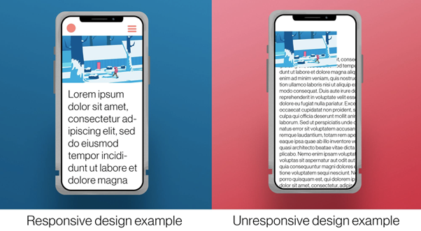

**<h1 align="center"> DAY 9: Responsive Design </h1>**

## **Responsive Design - Making Websites Fit All Sizes**

Think of responsive design as having an outfit that can change its size to fit you perfectly, whether you're a kid, a teenager, or an adult. Similarly, in web design, we want websites to look good and work well on all devices, from small phones to big computer screens.

### **Comparison of Responsive and Non-Responsive Design**

<div align="center">

</div>
<br>

In this example, we have two sides of the same web page. The right side represents a non-responsive design, making it challenging for users to read and navigate. On the other hand, the left side showcases a responsive design that offers a visually pleasing and user-friendly experience. Let's delve deeper into the differences between these two approaches and explore the importance of responsive web design.


***Try this example for yourself:***  
[CodePen - Responsive Design Example](https://codepen.io/pen?template=vYbBRpN) 


This example is a basic webpage with a responsive navigation menu. It will stack the navigation links vertically when the screen width is 768 pixels or smaller.

*Let's explain how the website becomes responsive step by step:*

1. **Viewport Meta Tag**: In the HTML code, you can see this line: `<meta name="viewport" content="width=device-width, initial-scale=1.0">`. This line tells the web browser to adjust the webpage's width to the device's screen width. It's like telling the browser to adapt to different screen sizes.

2. **CSS for Different Screen Sizes**:
   - In the CSS code (in `styles.css`), you'll notice lines like `@media (max-width: 768px)`. These are called media queries.
   - When the screen width is 768 pixels or less, the styles inside these media queries are applied. So, for smaller screens like tablets and phones, different styles are used.

3. **Navigation Changes**: When the screen is smaller (in the media query with 768px or less), the navigation menu (`<nav>`) changes. Instead of having all the menu items side by side, they are stacked on top of each other. This makes it easier to tap on a menu item with a finger on a small screen.

```css
@media (max-width: 768px) {
  nav ul {
    flex-direction: column;  /* This line stacks menu items vertically */
  }

  nav li {
    margin: 10px 0;  /* Adds space between stacked menu items */
  }
}
```


4. **Header Text Size**: In smaller screens, the text in the `<header>` becomes smaller. This is done to ensure it fits nicely on small screens without taking up too much space.

5. **Image Scaling**: The images "``" in the sections are set to have a maximum width of 100%. This means that on smaller screens, the images will automatically shrink to fit the screen width. This keeps them from being too large and helps the website load faster on mobile devices.

```css
img {
  max-width: 100%;  /* Makes images scale down to fit the screen width */
  height: auto;     /* Maintains the aspect ratio of the images */
}
```


6. **Text Size Adjustment**: As the screen gets even smaller (in the media query with 480px or less), the header text becomes even smaller. This ensures that everything fits and looks good on the tiniest screens like smartphones.

```css
@media (max-width: 480px) {
  #header-text {
    font-size: 20px;  /* Further reduces the font size of the header text */
  }

  img {
    width: 100%;  /* Makes images take up the full screen width */
  }
```

> So, in summary, the website becomes responsive by using a combination of HTML, CSS, and media queries. The CSS code tells the website how to adapt its layout, text size, and image size based on the screen width. This way, the website looks great and is easy to use no matter whether you're on a big computer screen or a small smartphone screen.

>If you want to delve deeper, here’s a link that can guide you:  
  [CSS-Tricks: A Complete Guide to CSS Media Queries](https://css-tricks.com/a-complete-guide-to-css-media-queries/) 


**<h2 align=center>CONGRATULATIONS! 🥳🎉 YOU HAVE COMPLETED THE CSS PART OF THE CODEQUEST - 30 DAYS OF FRONTEND!</h2>**

Next on your journey with CodeQuest is to learn how to use JavaScript in order to make things more interactive and fun for the user, But before that we'll be doing an exercise in order to test your newly acquired artistic skills in CSS by styling the previous HTML structure. 

Follow the guide below to know how to style your own blog post:

[First Project - Blog Post (CSS Styling)](../../projects/01-blog-post/CSS-README.md)

> ***NOTE***: **You don't have to use the same colors, theme, or anything really! In fact, we highly encourage you to follow your own vision for this project.**
> This is just a guide for those who are having a hard time thinking of a design on their own. The important thing is to learn while enjoying the process! 😊

