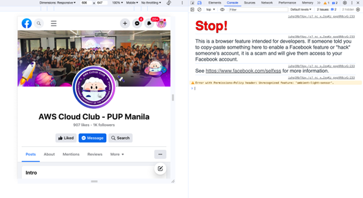
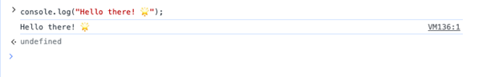

**<h1 align="center">DAY 12: Introduction to JavaScript</h1>**
## **Introduction to JavaScript:**


**JavaScript** is a programming language that makes websites interactive. It's one of the core technologies for web development. JavaScript is used **_to add interactivity to websites, to develop mobile apps, desktop applications, games_** and nowadays JavaScript can be used for **server-side programming**,  **_machine learning_** and **_AI_**.

### **Browser**
If you're learning JavaScript, the console is a great place to experiment with code snippets. You can write and run JavaScript code in real-time, which is a fantastic way to understand how the language works and see the results immediately.

We can write small JavaScript code on the browser console, but we do not use the browser console to develop applications.

**How to Open the Console in Google Chrome:**

1. Open Google Chrome on your computer.
2. Go to a website you want to experiment with  **[AWS Cloud Club PUP Manila -](https://www.facebook.com/AWSCloudClubPUPManila)**
3. Right-click anywhere on the webpage (not on an image or link), and from the context menu, select "Inspect" or "Inspect Element." This will open the Developer Tools panel. Or Open the console using shortcuts:

```sh
Mac
Command+Option+I

Windows:
Ctl+Shift+I
```

4. In the Developer Tools panel, click on the **"Console"** tab. This is where you can type and run your code.

<div align="center">

</div>

<br>

**Introduction to Syntax in the Console:**

●  **What is Syntax?**  
Syntax in programming refers to the rules that dictate how you must structure your code. It's like the grammar of a programming language, and following the right syntax is crucial for the computer to understand and execute your instructions.

●   **How to Write Code in the Console:**  
In the console, you can write code in JavaScript, which is a popular programming language for web development. Here's a simple example:

   ```javascript
   // This is a comment. The computer ignores it.
   console.log("Hello, coder!");
   ```

<div align="center">

</div>


The code starts with `console.log`. This is a function that tells the computer to "log" (display) the message in the parentheses. The message is in double quotes `"Hello, coder!"`.

*Now, here's a simple code snippet. Let's make a pop-up greeting message using JavaScript:*

```javascript
// Display a greeting message in the console
console.log("Hello there! 🌟");
```

## **Adding JavaScript to a Web Page**

You can put JavaScript on a web page in different ways. It's like adding special instructions to make your webpage do cool things. Let's look at these ways one by one.

### **Inline Script**

Imagine you have a webpage, and you want to make a button that says **"Click Me."** When you click it, you get a pop-up message. You can write this directly on your webpage. Here's how you can do it:

1. Make a folder on your computer, name it "CodeQuest: 30 Days Of Frontend," and create a file inside called "index.html."
2. Put this code inside "index.html":

   ```html
   <!DOCTYPE html>
   <html lang="en">
     <head>
       <title>CodeQuest: 30 Days Of Frontend:Inline Script</title>
     </head>
     <body>
       <button onclick="alert('Welcome to CodeQuest: 30 Days Of Frontend!')">Click Me</button>
     </body>
   </html>
   ```

3. Open "index.html" in a web browser (like Chrome) and click the button. You'll see a pop-up message.

### **Internal Script**

You can also put your JavaScript inside the webpage, either in the head or body part. Here's how it looks in the head:

```html
<!DOCTYPE html>
<html lang="en">
  <head>
    <title>CodeQuest: 30 Days Of Frontend:Internal Script</title>
    <script>
      console.log('Welcome to CodeQuest: 30 Days Of Frontend)
    </script>
  </head>
  <body></body>
</html>
```

When you open the browser's console (like in Chrome), you'll see "`Welcome to CodeQuest: 30 Days Of Frontend`"

### **External Script**

This is like writing your JavaScript in a separate file. First, create a file named "introduction.js" with your JavaScript code, like this:

```js
console.log('Welcome to CodeQuest: 30 Days Of Frontend)
```

***Then, link it in your webpage:***

```html
<!DOCTYPE html>
<html lang="en">
  <head>
    <title>CodeQuest: 30 Days Of Frontend:External script</title>
    <script src="introduction.js"></script>
  </head>
  <body>
  </body>
</html>
```

The "introduction.js" file contains the JavaScript code, and the HTML page links to it. When you open your webpage, you'll see ***"Welcome to CodeQuest: 30DaysOfFrontend"*** in the console.


### Multiple External Scripts

You can link more than one external JavaScript file. For example, you can have "helloworld.js" too:

```js
console.log('Hello, World!')
```

Then, link both files in your webpage:

```html
<!DOCTYPE html>
<html lang="en">
  <head>
    <title>Multiple External Scripts</title>
  </head>
  <body>
    <script src="./helloworld.js"></script>
    <script src="./introduction.js"></script>
  </body>
</html>
```

> Now, when you open your webpage, you'll see both "Hello, World!" and **Welcome to CodeQuest: 30 Days Of Frontend!** in the console. Just remember, the main.js file should be linked below all other scripts.

**<h2> Introduction to JavaScript: Day 12 Assignment </h2>**

### **Submission Guidelines:**
1. Read the assignment instructions in the index.js file and organize your code and files neatly in the [javascript-tasks/day-12](../javascript-tasks/day-12/) folder.
2. Submit the entire folder, including HTML files and JavaScript files.

***That's how you add JavaScript to your web pages! Have fun experimenting!***
