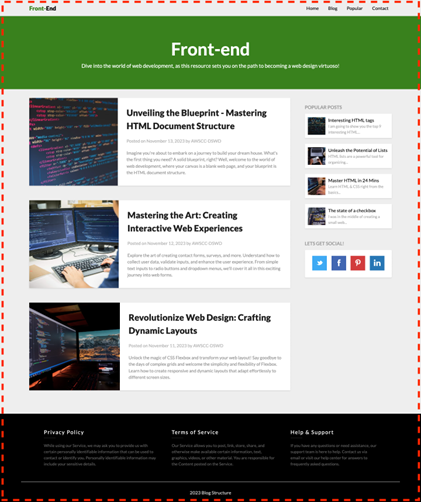
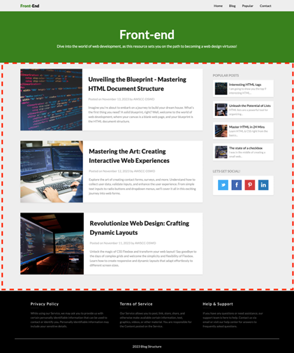
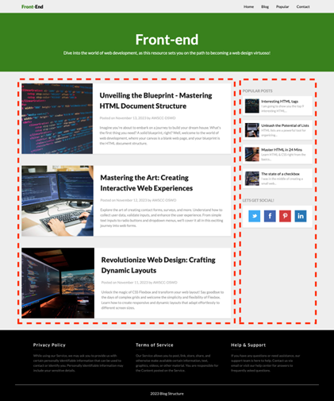
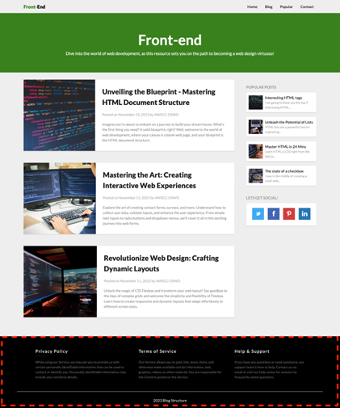

# **CodeQuest: Blog Template**

## **HTML Structure**

### **Step 1: Set Up a Repository**

1. Create a new repository on your preferred version control platform (e.g., GitHub).
2. Clone the repository to your local machine.

### **Step 2: Create an HTML File**

1. Inside your local repository, create a new HTML file. You can name it `index.html`.
2. Open the file in your preferred code editor.

### **Step 3: Add HTML Boilerplate**

NOTE: By clicking “!” and pressing the tab button on your keyboard, this boilerplate will be automatically created.

```html
<!DOCTYPE html>
<html lang="en">
<head>
    <meta charset="UTF-8">
    <meta http-equiv="X-UA-Compatible" content="IE=edge">
    <meta name="viewport" content="width=device-width, initial-scale=1.0">
    <title>Structure Blog Using HTML</title>
</head>
<body>
    <!-- Your content will go here -->
</body>
</html>
```
***Let's break down the structure of this HTML code:***

1. `<!DOCTYPE html>`: This is a declaration that indicates the document type and version of HTML being used. In this case, it's HTML5.

2. `<html lang="en">`: This tag represents the root of the HTML document. The `lang` attribute specifies the language of the document, which is English in this case.

3. `<head>`: This section contains meta-information about the HTML document, such as character encoding, viewport settings, title, and linked stylesheets.

   - `<meta charset="UTF-8">`: Declares the character encoding for the document as UTF-8, which is a widely used character encoding for handling various characters and symbols.
   
   - `<meta http-equiv="X-UA-Compatible" content="IE=edge">`: This meta tag is used for specifying the version of Internet Explorer to be used to render the web page. "IE=edge" ensures the latest rendering engine is used.

   - `<meta name="viewport" content="width=device-width, initial-scale=1.0">`: This meta tag sets the viewport properties. It is essential for responsive web design. `width=device-width` ensures the width of the viewport is set to the device width, and `initial-scale=1.0` sets the initial zoom level to 1.

   - `<title>Blog Template</title>`: Sets the title of the HTML document, which is displayed on the browser tab or window. NOTE: You can change this to whatever you want.


4. `<body>`: This is the main content of the HTML document. It contains all the visible content, such as text, images, links, and other HTML elements.

   - `<!-- Your content will go here -->`: This is an HTML comment. Comments are ignored by browsers and are for the developer's reference. It suggests the placeholder where you would insert your actual content.

This HTML code is a starting point for building a web page and is crucial for ensuring proper rendering and functionality across different devices and browsers.


### **Step 4: Create the Overall Container**
In Step 4, the focus is on creating an overall container for your HTML document. This container is a wrapping element that encapsulates the entire content of your webpage. 

<div align="center">

</div>

1. Inside the `<body>` tag, add a `<div>` as the overall container with a comment.
   ```html
   <div>
       <!-- Your content goes here -->
   </div>
   ```


### **Step 5: Create the Header**
In Step 5, we're focusing on creating the header section of the HTML document. The header typically contains elements that are considered part of the introductory or navigational aspects of a webpage. Here's a breakdown of the sub-steps:

<div align="center">

</div> 

1. **Header Section Opening:**
   ```html
   <header>
   ```
   - We start by using the `<header>` tag to define the beginning of the header section. This tag is a semantic HTML5 element specifically designed for headers, making the document's structure more meaningful.

2. **Navigation Bar:**

<div align="center">

</div>

   ```html
   <!-- Navigation Bar -->
   <nav>
       <!-- Navigation bar content goes here -->
   </nav>
   ```
   - Inside the `<header>`, we use the `<nav>` (navigation) tag to indicate the presence of the navigation bar. This tag is suitable for grouping navigation links.

3. **Content Section in Header:**

<div align="center">

</div>
 
   ```html
   <!-- Content Section in Header -->
   <section>
       <!-- Content in the header goes here -->
   </section>
   ```
   - Also within the `<header>`, we use the `<section>` tag to create a distinct section within the header. This includes the introductory text, a content specific to the header.

4. **Header Section Closing:**
   ```html
   </header>
   ```
   - Finally, we close the `<header>` section to encapsulate all the header-related content.


### **Step 6: Main Content Area**
Step 6 involves adding the main content section to your HTML document. This section will contain the blog posts and a sidebar. Here's a breakdown of how you can achieve this:

<div align="center">

</div>
 
1. **Add Main Content Section:**
   - Below the `<header>`, create a `<main>` f or the main content.
   ```html
   <main>
       <!-- Main content goes here -->
   </main>
   ```

2. **Add Blog and Sidebar Sections:**


   - Inside the `<main>`, create one `<section>` element for the blog content and one ‘<aside>’ element for the sidebar.

<div align="center">

</div>

     ```html
     <div>
         <!-- Blog content goes here -->
     </section>

     <div>
         <!-- Sidebar content goes here -->
     </aside>
     ```

### **Step 7: Footer**
In Step 7, you'll be creating the footer section of your HTML document. The footer typically contains information such as privacy policy, terms of service, and help content. Here's how you can achieve this:

<div align="center">

</div>
 

1. **Add Footer Section:**
   - After the closing tag of the `<div>`, add the footer section.
     ```html
     <footer>
         <!-- Footer content goes here -->
     </footer>
     ```

### **Step 8: Complete HTML Structure**


There! The HTML part of the code is done! Next, it is time to style this boring page using CSS. Next up is the CSS part of the code which you'll continuing from day 4-9

***<h2 align=center> >>> CONTINUE AFTER YOU FINISH DAY 9!!! <<< <br> YOU CAN DO IT!!! 🥊 </h2>***